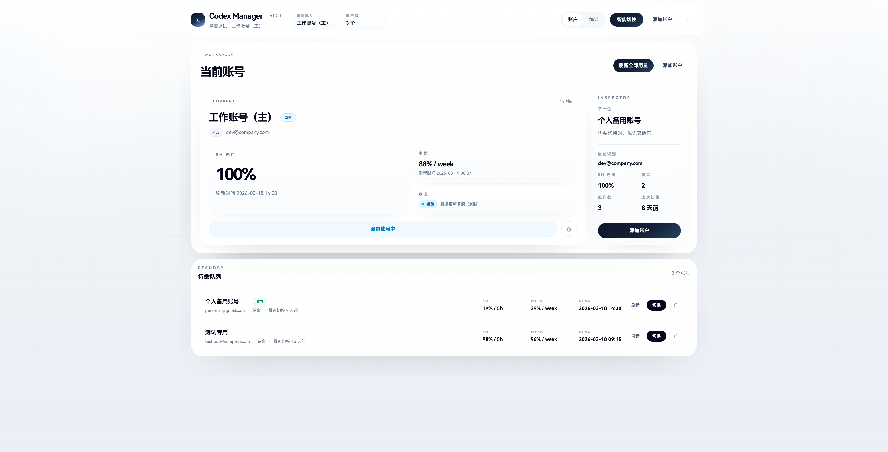

# Codex Manager

A desktop account manager for switching between multiple OpenAI/Codex accounts without breaking your current Codex session flow.

[简体中文](./README.md)

[](https://github.com/davaded/codex-manager/releases)
[](https://github.com/davaded/codex-manager/releases)
[](./LICENSE)
[](https://github.com/davaded/codex-manager/actions)
[](#installation)

## Preview

Main window:



Tray panel for quick switching and quota checks:


## Why

If you use multiple Codex/OpenAI accounts, two problems show up quickly:

- It is hard to tell which account is active.
- Real quota usage is hard to compare.

Codex Manager reduces both to a few desktop and tray actions.

## Features

- Add accounts with OAuth or import the current `~/.codex/auth.json`
- Detect when the current live auth belongs to an unmanaged account
- Import the current live auth with one click
- Keep the shared `~/.codex/sessions` working set intact when switching
- Read real 5-hour and weekly quota usage
- Refresh usage globally or per account
- Smart switch to the account with more available quota
- Use a translucent tray panel for quick switching
- Optionally restart the Codex desktop app after switching
- Export backups and persist app settings
- Switch managed accounts from the command line with `codex-manager`

## Installation

Recommended: download a packaged build from GitHub Releases.

- Windows: `.msi` or `.exe`
- macOS: `.pkg` or `.dmg`
- Linux: `.deb`, `.rpm`, or `.AppImage`

Releases: <https://github.com/davaded/codex-manager/releases>

### CLI Availability

After installation, the `codex-manager` command behaves like this:

| Platform | Recommended package | CLI availability |
| --- | --- | --- |
| Windows | `.exe` or `.msi` | Installed to `PATH` automatically |
| macOS | `.pkg` | Linked to `/usr/local/bin/codex-manager` automatically |
| macOS | `.dmg` | Use the bundled helper script once |
| Linux | `.deb` or `.rpm` | Available directly as `codex-manager` |
| Linux | `.AppImage` | Use the helper script once, or keep it portable |

Notes:

- On Windows, reopen your terminal after installation so the new `PATH` is picked up.
- On macOS, prefer the `.pkg` build if you want `codex-manager` available immediately in Terminal.
- On Linux, prefer `.deb` or `.rpm` if you want a package-managed CLI experience.
- The app reads and writes `~/.codex/auth.json`, so Codex CLI should already be installed and working.

## Command Line Switching

You can switch managed accounts from the command line:

```bash
codex-manager list
codex-manager switch work
codex-manager switch dev@company.com
codex-manager switch 2
```

The CLI updates both the managed `accounts.json` state and the live `~/.codex/auth.json`.

If Codex CLI or the desktop app is already running, restart it after switching so the new auth takes effect.

For `.dmg` and `.AppImage` installs, the release helper script can expose the command globally:

```bash
sudo bash ./install-unix-cli.sh /Applications/codex-manager.app /usr/local/bin/codex-manager
```

If you are running from the repo locally, you can still expose the Node-based dev CLI with:

```bash
npm link
```

## Quick Start

1. Launch Codex Manager.
2. Import the current auth or add an account via OAuth.
3. Refresh usage.
4. Switch manually, use Smart Switch, or use `codex-manager switch ...`.

## Active Account Detection

The app reads `~/.codex/auth.json` and identifies the current account in this order:

1. `email`
2. `userId`
3. `chatgpt_account_id` from saved credentials
4. `refresh_token / access_token / id_token`

If the live auth does not match any managed account but still contains a recognizable identity, the app shows it as an unmanaged current account instead of incorrectly keeping an old managed account active.

## Import Current Auth

`Import Current Auth` reads the already active `~/.codex/auth.json` on your machine and registers it as a managed account.

During import, the app:

1. Reads the current `auth.json`
2. Parses `email / userId / accountId`
3. Matches existing accounts to avoid duplicates
4. Saves credentials and refreshes quota data

If the auth state already belongs to an existing account, the app updates that account instead of creating a duplicate.

## Smart Switch

`Smart Switch` refreshes quota data first, then selects the best candidate among accounts with valid usage data.

Current rule set:

- Prefer the account with the lowest `5h` usage
- If `5h` usage is tied, compare weekly usage
- If the active account is already the best choice, do nothing

## Tray Panel

The desktop app creates a system tray icon and a quick action panel.

Current tray behavior:

- Left click toggles the tray panel
- Clicking outside the panel hides it
- Tray menu interactions do not accidentally reopen the panel
- The floating panel stays close to the tray area with platform-specific positioning
- You can import current auth, run Smart Switch, refresh usage, and switch quickly from the tray

## How It Works

The switch flow is handled serially by the Tauri backend. The main logic lives in [`src-tauri/src/commands/sessions.rs`](./src-tauri/src/commands/sessions.rs).

Current flow:

1. Read the current shared `~/.codex/sessions` state
2. Write the target account's `auth.json`
3. Keep the shared session working set unchanged
4. Restart the Codex desktop app if the setting is enabled

Stability safeguards:

- A global lock prevents concurrent switches
- Failed writes to `auth.json` are rolled back
- Local persistence failures do not incorrectly mark the switch as failed
- Auto-restart shows a confirmation dialog
- Auto-restart failure does not undo the account switch

## Data and Paths

App data is stored in the system app-data directory. Main files include:

- `accounts.json`: account list and UI state
- `settings.json`: theme, proxy, auto-refresh, and restart-after-switch settings
- `credentials/<account-id>.json`: saved credentials per account
- `sessions/<account-id>/`: legacy compatibility snapshot directory

The live Codex directory remains:

- `~/.codex/auth.json`: currently active account
- `~/.codex/sessions`: session directory shared by CLI and the desktop app

## Development

Prerequisites:

- Node.js 18+
- Rust stable
- Tauri v2 build environment

Install dependencies:

```bash
npm install
```

Run Tauri in development:

```bash
npm run tauri dev
```

Run the frontend only:

```bash
npm run dev
```

Build checks:

```bash
npm run build
cd src-tauri
cargo check
```

## Roadmap

- More real-device validation for macOS and Linux installers
- Migrate OAuth browser opening from `tauri-plugin-shell` to `tauri-plugin-opener`
- Better diagnostics for port conflicts, permissions, and auth/session directory errors
- More refined tray positioning and platform-specific desktop behavior

## Security Notes

- The app stores credentials locally, so do not use it on untrusted machines.
- The project does not intentionally upload credentials to third parties; quota reads go through official OpenAI-related endpoints.
- If you do not want credentials stored locally, do not add accounts.

## Known Limitations

- OAuth browser opening still uses the deprecated `tauri-plugin-shell` `open` API
- Automatic Codex desktop restart is currently implemented and verified only on Windows
- Most end-to-end installer validation so far has happened on Windows; macOS and Linux still need more real-device testing
- Browser-only preview mode still keeps mock fallback behavior for UI inspection
